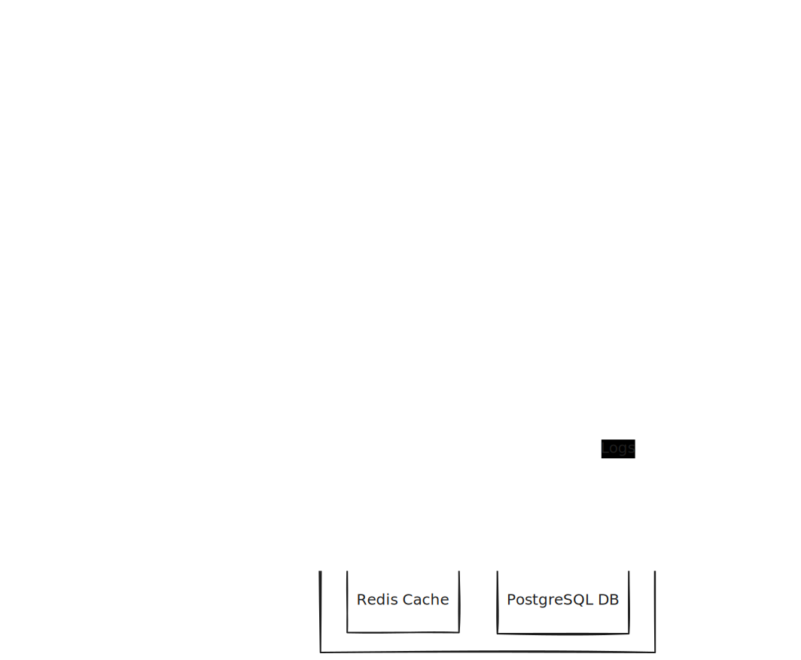

# Task Manager API

A Go backend for managing tasks, organizations, and team collaborations. This system features real-time background processing for email notifications, secure JWT-based authentication, and a scalable architecture.

## Overview

The Task Manager API is designed to handle high-concurrency task tracking with a strong focus on reliability and user notification. It doesn't just store tasks; it ensures that your team stays informed through a dedicated background worker system that tracks deadlines and assignments.

### Key Features
*   **Multi-Tenancy**: Organize tasks within specific Organizations with member roles.
*   **Secure Auth**: JWT access/refresh token rotation with OTP-verified signup.
*   **Intelligent Notifications**: Automated "Due Soon" and "Overdue" email alerts.
*   **Reliable Workers**: Notification tracking in the DB to prevent duplicate emails and handle retries.
*   **Performance Monitoring**: Built-in Prometheus metrics and health checks.
*   **Rate Limiting**: Redis-backed rate limiting to protect API resources.

---

## 🏗 System Architecture

The project follows a clean architecture pattern, separating concerns into Handlers, Services, and Repositories.



### Notification Lifecycle
1.  **Task Assigned**: Triggered immediately upon task creation or reassignment.
2.  **Due Soon**: Scanned by `ReminderWorker` every minute (checks for tasks due within 24h).
3.  **Overdue**: Scanned by `ReminderWorker` for tasks past their deadline.
4.  **Tracking**: All notifications are logged in the `task_notifications` table to ensure we never spam users on server restarts.

---

## 🚀 Getting Started

### Prerequisites
*   Go 1.22+ (if running locally)
*   Docker & Docker Compose
*   Make

> The make file is overengineered 😅, i just learned Making Makefile so i use my all knowledge and implement everything here it may have some bugs i dont think so coz its working in my machine

### Quick Start (Docker)
The easiest way to get the environment up is using Docker Compose:

```bash
git clone https://github.com/aminshahid573/taskmanager.git
cd taskmanager

make docker-rebuild

# The API will be available at http://localhost:8080
```

### Local Development
If you prefer running the Go binary locally:

```bash
make deps
```

### Step 1: Configuration
 We use YAML for configuration. production.yaml is the master template.
 local.yaml is ignored by git, so you should create it for your local settings.
 ```bash
 cp config/production.yaml config/local.yaml
```
### Step 2: Database
 Make sure you have Postgres running, then run migrations:
```bash
make migrate-up
```
### Step 3: Run
 Start with hot-reload (requires 'air' installed)
```bash
make dev
```

---

## 🛠 API Documentation

All API requests (except public/auth) require an `Authorization: Bearer <token>` header.

### Authentication
| Method | Endpoint | Description |
| :--- | :--- | :--- |
| `POST` | `/api/v1/auth/signup` | Register a new user |
| `POST` | `/api/v1/auth/verify-otp`| Verify email via OTP |
| `POST` | `/api/v1/auth/login` | Login and get access/refresh tokens |
| `POST` | `/api/v1/auth/refresh` | Get new access token |
| `POST` | `/api/v1/auth/logout` | Invalidate current session |

### Organizations
| Method | Endpoint | Description |
| :--- | :--- | :--- |
| `POST` | `/api/v1/organizations` | Create an organization |
| `GET` | `/api/v1/organizations` | List organizations you belong to |
| `GET` | `/api/v1/organizations/{id}` | Get organization details |
| `POST` | `/api/v1/organizations/{id}/members` | Add user to organization |

### Tasks
| Method | Endpoint | Description |
| :--- | :--- | :--- |
| `POST` | `/api/v1/organizations/{orgId}/tasks` | Create a new task |
| `GET` | `/api/v1/organizations/{orgId}/tasks` | Filter and list tasks |
| `GET` | `/api/v1/organizations/{orgId}/tasks/{id}` | Get specific task details |
| `PUT` | `/api/v1/organizations/{orgId}/tasks/{id}` | Update task content/status |
| `DELETE`| `/api/v1/organizations/{orgId}/tasks/{id}` | Soft delete a task |
| `PUT` | `/api/v1/organizations/{orgId}/tasks/{id}/assign` | Assign task to a user |

---

## 📡 Monitoring
*   **Health Check**: `GET /health`
*   **Prometheus Metrics**: `GET /metrics`
*   **Rate Limit Stats**: `GET /admin/ratelimit/stats` (Admin only)

---

## 📦 Project Structure
```text
├── cmd/api/            # Entry point for the application
├── api-tests/
├── internal/
│   ├── app/           # App initialization and dependency injection
│   ├── domain/        # Core models and domain interfaces
│   ├── handler/       # HTTP request handlers
│   ├── service/       # Business logic layer
│   ├── repository/    # Database and cache persistence
│   ├── worker/        # Background notification workers
│   └── middleware/    # Auth, logging, recovery, rate-limiting
└── migrations/        # SQL migration files
```

---
## 🧪 API Testing

We have a dedicated suite of interactive shell scripts for testing all API endpoints manually. These scripts are located in the `api-tests/` directory and use `curl` and `jq`.

> I use my understanding of shell scripting in `api-tests` so kindly take a look

```bash
# Run the test scripts (requires bash and jq)
bash api-tests/auth/signup.sh
bash api-tests/task/list.sh
```

For detailed instructions on authentication flows and automatic token management, check out the [API Tests README](api-tests/README.md).

---

## 📜 Environment Variables
Copy `.env.example` to `.env` and configure accordingly:
*   `DB_HOST`: Database host
*   `JWT_ACCESS_SECRET`: Secret for signing access tokens
*   `EMAIL_SMTP_HOST`: SMTP server for notifications
*   `RATE_LIMIT_ENABLED`: Set to `true` to enable Redis rate limiting

---

## 👨‍💻 Contributing
1.  Check existing issues or open a new one.
2.  Fork the repo and create your feature branch.
3.  Ensure code passes `make lint` and `make test`.
4.  Submit a Pull Request.

---

